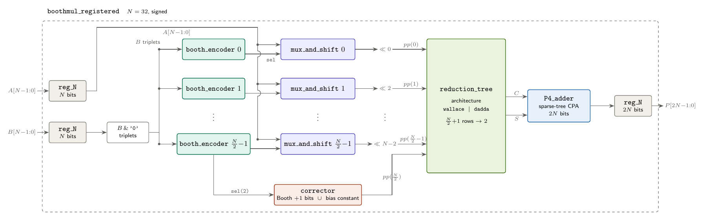
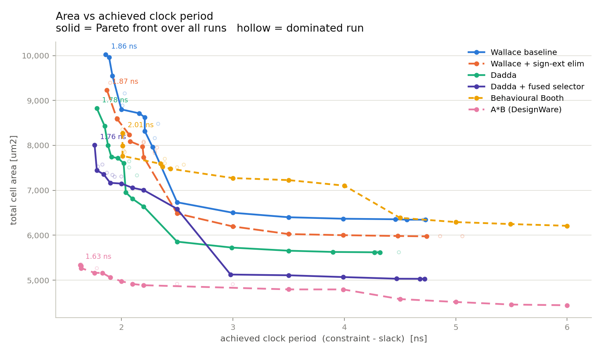
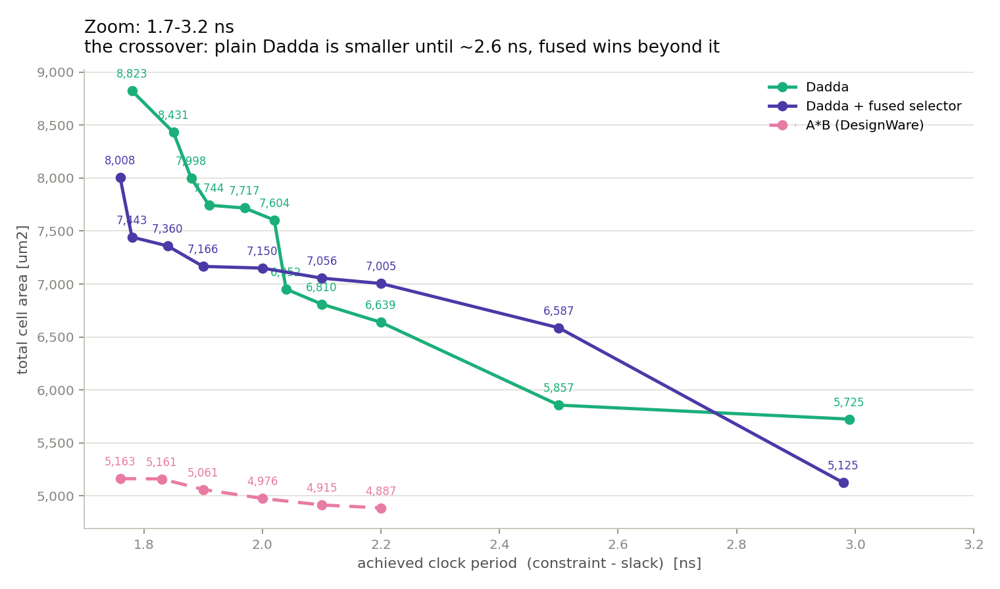

# Radix-4 Booth Multiplier — 32-bit, Nangate 45 nm

A signed 32×32 multiplier in structural VHDL with three architectural
optimizations applied in sequence. Every variant is a different **architecture**
of the same entity, bound by a VHDL configuration, so all six share one source
tree, one testbench and one synthesis script. A multiplier inferred by Design
Compiler from a plain `A * B` is synthesised under identical conditions as an
absolute reference.

|                                      |                                     |
| :----------------------------------- | :---------------------------------- |
| **Fastest achieved period**          | **1.76 ns**&nbsp;&nbsp;(ref. 1.63 ns) |
| **Smallest area**                    | **5029 um²**&nbsp;&nbsp;(ref. 4441 um²) |
| **Area gap to the reference closed** | **69.1 %**                          |
| Verification                         | exhaustive at 8 bits, corners + 20 000 random at 32 |
| Sweep                                | 6 variants × 21 clock periods = 126 runs |

📄 **[Report](docs/report.pdf)** · 🎞 **[Slides](docs/presentation.pdf)** · ✏️ **[Schematic source](docs/schematic.drawio)**

---

## Architecture



| Variant                | `mux_and_shift`  | `corrector`      | `reduction_tree` |
| :--------------------- | :--------------- | :--------------- | :--------------- |
| Wallace baseline       | `sign_extend`    | `sign_extend`    | `wallace`        |
| + sign-ext. elimination | `no_sign_extend` | `no_sign_extend` | `wallace`        |
| + Dadda reduction      | `no_sign_extend` | `no_sign_extend` | `dadda`          |
| **+ fused selector**   | `fused_selector` | `no_sign_extend` | `dadda`          |
| Behavioural Booth      | `behavioural`    | —                | — (adder chain)  |
| Inferred reference     | — (`P <= A * B`) | —                | —                |

The row format and the corrector are bound as a unit: `no_sign_extend` and
`fused_selector` bias each row by `+2^(2i+N)`, which `corrector(no_sign_extend)`
cancels. The Dadda schedule is derived from the sign-extension-eliminated
layout, so it pairs with those two row formats.

*Report §2 — recoding and datapath. §3–§5 — the three optimizations. §A.3 — the configuration mechanism.*

---

## Results



| Variant                     | Achieved   | Area        | Cells @ 3 ns | Gap closed |
| :-------------------------- | ---------: | ----------: | -----------: | ---------: |
| Wallace baseline            |    1.86 ns |    6346 um² |         4639 |          — |
| + sign-extension elimination |    1.87 ns |    5975 um² |         4455 |     19.5 % |
| + Dadda reduction           |    1.78 ns |    5620 um² |         3936 |     38.1 % |
| **+ fused Booth selector**  | **1.76 ns** | **5029 um²** |     **2819** | **69.1 %** |
| Behavioural Booth           |    2.01 ns |    6210 um² |         4863 |      7.1 % |
| Inferred `A * B`            |    1.63 ns |    4441 um² |         3035 |  reference |

Periods are **achieved** (`constraint − slack`), not requested; curves are Pareto
fronts over the whole sweep. The two Dadda variants cross twice, so the better
choice depends on the target period:



*Report §7.2 — the achieved-period metric. §8 — analysis. §B — the source report behind each number.*

---

## Repository

```
rtl/
  common/                     iv, nd2, mux21, mux21_generic, fa, ha
  adder/                      P4 sparse-tree carry-propagate adder chain
  multiplier/
    packages/
      common_pkg              NBIT, pp_word, pp_array, sign_ext_const
      wallace_math_pkg        row counts and depth for the uniform CSA tree
      dadda_types_pkg         Dadda height sequence, matrix types, NUM_LAYERS_D
      dadda_math_pkg          the schedule and the port-map analysis functions
    booth_encoder             triplet of B -> sel = {neg, double, enable}
    mux_and_shift             one partial-product row: 0, +/-A, +/-2A
    corrector                 Booth +1 bits and the sign-extension constant
    CSA, wallace_tree         3:2 compression on whole rows
    dadda_tree                per-column compression from the schedule matrices
    reduction_tree            wrapper; selects wallace or dadda
    boothmul, reg_N, boothmul_registered
  super_beh_multiplier_registered.vhd    the A*B reference design

tb/          tb_multiplier, tb_boothmul_registered
cfg/         configurations_boothmul / _tb / _synthesis
sim/         compile.do, sim.do
synthesis/   syn/synthesis.tcl, syn/boothmul_registered.sdc, syn/reports/, plot_pareto.py
docs/        report, presentation, schematic (.tex and .pdf), figures/
```

`NBIT` in `common_pkg` sets the operand width for the design, the reduction
schedule and the testbench together. `dadda_math_pkg.constructing_dadda`
computes the whole reduction schedule at elaboration time and returns three
matrices — full-adder sources, half-adder sources, and the bits no compressor
consumes — from which `dadda_tree` derives its port maps.

---

## Running it

**Simulation** — select the variant at the top of `sim.do`
(`cfg_tb_dadda_fused_sel`, `cfg_tb_dadda`, `cfg_tb_wal_opt`, `cfg_tb_wal_base`,
`cfg_tb_beh`, `cfg_tb_super_beh`):

```tcl
cd sim
do compile.do
do sim.do
```

At `NBIT ≤ 8` the testbench is exhaustive; above it, corner cases plus 20 000
random pairs.

**Synthesis** — writes a netlist, SDC, SDF and five reports per configuration
per clock period:

```tcl
cd synthesis/syn
dc_shell -f synthesis.tcl
```

**Figures and tables** — parses the report tree directly:

```bash
cd synthesis
python3 plot_pareto.py syn/reports -o ../docs/figures --zoom 1.7 3.1
```

**Documents**:

```bash
cd docs
pdflatex schematic.tex
pdflatex report.tex       && pdflatex report.tex
pdflatex presentation.tex && pdflatex presentation.tex
```
