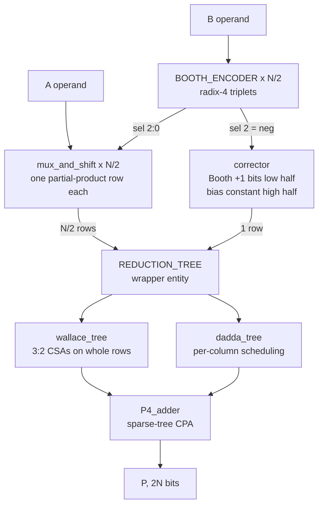

# Radix-4 Booth Multiplier — 32-bit, Nangate 45 nm

A structural VHDL signed multiplier built up through four architectural
optimizations, each one measured against the previous and against Synopsys
DesignWare as a reference point. Simulated in ModelSim / Questa, synthesised
with Design Compiler using `compile_ultra` over a 21-point clock sweep.

**Headline result: the final design runs at 1.76 ns — within 8% of the
DesignWare multiplier that `A * B` infers — and at relaxed timing comes within
13% of its area, recovering 69% of the distance between a naive structural
implementation and production IP.**


| variant | fastest achieved | smallest area | gap closed |
|---|---|---|---|
| Wallace baseline | 1.86 ns | 6345.7 µm² | — |
| Wallace + sign-extension elimination | 1.87 ns | 5974.9 µm² | 19.5% |
| Dadda reduction | 1.78 ns | 5619.8 µm² | 38.1% |
| **Dadda + fused Booth selector** | **1.76 ns** | **5029.0 µm²** | **69.1%** |
| Behavioural Booth (`+` chain) | 2.01 ns | 6210.0 µm² | 7.1% |
| `A * B` (DesignWare) | 1.63 ns | 4441.1 µm² | reference |

Periods are **achieved**, not requested — see [Reading the sweep](#reading-the-sweep).

All variants are the same entity with different architectures bound by VHDL
configuration, synthesised through an identical script, and verified against the
same testbench.

---

## Architecture



| stage | block | what it does |
|---|---|---|
| encode | `booth_encoder` | one radix-4 encoder per bit pair of B → `sel = {neg, double, enable}` |
| generate | `mux_and_shift` | one partial-product row: `0`, `±A`, `±2A` |
| correct | `corrector` | one extra row: Booth `+1`s low, bias constant high |
| reduce | `wallace_tree` / `dadda_tree` | N/2+1 rows down to carry + sum |
| add | `P4_adder` | sparse-tree carry-propagate adder → 2N-bit product |

`REDUCTION_TREE` is a thin wrapper with `wallace` and `dadda` architectures, so
swapping trees never touches `BOOTHMUL`.

---

## Optimization 1 — sign-extension elimination

Each Booth row holds an **(N+1)-bit two's complement** value. Its MSB is a
*sign* bit with negative weight, but the reduction tree adds unsigned. The
textbook fix replicates that sign bit up to bit 2N−1 — at N=32 that is **256 of
the 800 live bits in the array, 32%**, all copies of one net.

Since `s + ~s = 1`, we have `−s = ~s − 1`, so:

$$-s_i \cdot 2^{P} \;=\; \tilde{s_i}\cdot 2^{P} \;-\; 2^{P}$$

`~s` sits at position `P` — the slot the sign bit already occupied. No bit is
added; one bit is *inverted*, everything above it is zero-filled.

The leftover is a constant because the error does not depend on the data:

| `s` | wanted | array holds `~s` | error |
|---|---|---|---|
| 0 | 0 | +2^P | **+2^P** |
| 1 | −2^P | 0 | **+2^P** |

Summed over all N/2 rows the design owes
`C = −Σ 2^(2i+N) mod 2^(2N)`, which is the pattern `0xAAAA...AB` in bits
`2N-1 downto N` (`0xB` at N=4, `0xAAAAAAAB` at N=32). See
`common_pkg.sign_ext_const`.

**It costs no extra row.** `C` occupies only bits `2N-1 downto N`; the Booth
`+1` carries occupy only `N-1 downto 0`. They never overlap, so one row carries
both. That is all `corrector` does.

Measured: **6345.7 → 5974.9 µm² at relaxed timing.**

---

## Optimization 2 — Dadda reduction

Wallace compresses maximally at every level: every group of three rows goes into
a CSA across the full width. Wherever fewer than three of those rows have a live
bit in a column, the CSA degenerates into a **half adder** — a cell that takes
two bits in and puts two bits out, reducing nothing.

Dadda computes a target height per level from the sequence
`2, 3, 4, 6, 9, 13, 19 …` and **only touches columns that exceed it**.

The full-adder count barely moves (436 → 435 at N=32) — every eliminated bit
costs exactly one full adder, so that number is fixed by the array. What Dadda
removes is half adders: **148 → 45**.

### The rule

For column `k` at level `L` there are two distinct carry counts, and confusing
them is the trap:

| | meaning |
|---|---|
| carries in | adders in column `k-1` — land in column `k` at level L+1 |
| carries out | adders in column `k` — land in column `k+1` at level L+1 |

Only bits **present at level L** can feed an adder, but the target is checked
against `present + carries in`:

```
excess = count + carry_in - target
while excess > 0 :  FA if excess >= 2 (removes 2), else HA (removes 1)
                    require 3*nFA + 2*nHA <= count
```

Columns are visited LSB → MSB, because `carries in` for column `k` is unknown
until `k-1` is decided.

### Implementation

`dadda_math_pkg.constructing_dadda` builds the whole schedule at elaboration and
returns three matrices:

| index | matrix | contents |
|---|---|---|
| 0 | `remaining_system` | bits no adder consumed — the pass-through sources |
| 1 | `HA_matrix` | the two source row positions of each half adder |
| 2 | `FA_matrix` | the three source row positions of each full adder |

The function walks levels top-down and, for each column, marks the actual rows
feeding each adder and **clears those bits**. Whatever survives is by definition
the pass-through set, which is why one pass produces all three matrices
consistently. `fa_arg_func`, `ha_arg_func` and `remaining_bit_pos` then recover
the exact row indices for the port maps.

This matters because columns are *sparse* — live bits are not packed into rows
0,1,2… Tracking real positions rather than assuming a packed layout is what
makes the tree correct for a staggered Booth array.

### Slot convention

Within a column at level L+1, slots are allocated in a fixed order:

```
[ carries arriving from column k-1 ]  carry_in
[ sums produced in column k        ]  nFA + nHA
[ bits passed through untouched    ]  count - 3*nFA - 2*nHA
```

Carries are written directly into column `k+1`, so unlike the CSA tree — where
`Carry(i+1) <= Carry_temp(i)` does the ×2 — there is **no final shift**.

Measured: **5974.9 → 5619.8 µm², fastest achieved 1.87 → 1.78 ns.**

---

## Optimization 3 — fused Booth selector

The biggest single win, and it came from reading the gate-level netlist.

`mux_and_shift(no_sign_extend)` builds each row in **two levels**: a mux picks
`A`/`2A`/`0`, then every bit is XORed with `sel(2)`:

```vhdl
q := q xor (q'range => sel(2));    -- N+1 XOR cells, every row
```

At N=32 that is 33 × 16 = **528 XOR2 cells** whose only job is inverting.

`mux_and_shift(fused_selector)` never separates the two. The row control is
decoded **once** into four mutually exclusive signals, and each output bit is a
single flat sum of products:

```vhdl
q(i) <= (c_pos1 and     src1(i))     -- +A
     or (c_neg1 and not src1(i))     -- -A
     or (c_pos2 and     src2(i))     -- +2A
     or (c_neg2 and not src2(i));    -- -2A
```

DC maps that to one AOI/OAI compound cell per bit. The `not src` terms are the
same function of `A` in every row, so common-subexpression elimination shares
one set of inverters across all 16 rows.

Four terms suffice because the encoder never emits `sel(2)='1'` with
`sel(0)='0'` — a row is never both zeroed and negated.

### What it did to the netlist

| | XOR2 | XNOR2 | **XOR total** | FA_X1 | total cells |
|---|---|---|---|---|---|
| Dadda | 287 | 943 | **1230** | 117 | 3936 |
| Dadda + fused | 37 | 48 | **85** | **448** | 2819 |
| `A*B` (DesignWare) | 436 | 123 | 559 | 268 | 3035 |

XORs fell **93%**. The unexpected part is `FA_X1`: **117 → 448**. The tree
instantiates 435 FA + 45 HA, and it now maps essentially 1:1 onto library
full-adder cells. The 528 negation XORs had been polluting the logic cone badly
enough that DC restructured the whole tree into generic gates instead of
recognising adders. Removing them let the adders map cleanly — a second,
larger saving that was not the stated goal.

Measured: **5619.8 → 5029.0 µm², fastest achieved 1.78 → 1.76 ns.**

---

## Why any of this is exact

Every step is arithmetic in **Z / 2^(2N) Z**. The product output is 2N wires; a
value of weight 2^(2N) has nowhere to live. Three facts the design relies on are
really one fact — *multiples of 2^(2N) are zero*:

| statement | where it is used |
|---|---|
| `−x = ~x + 1` | Booth negation, with the `+1` deferred to `corrector` |
| ones from bit *p* upward `≡ −2^p` | the sign-extension identity |
| dropping a carry out of bit 2N−1 is free | CSA carry shift; Dadda's top-column carry |

A signed N×N product always fits in 2N bits, so the residue the hardware
produces **is** the true answer. If the output were 2N+1 bits wide and the top
bit mattered, none of these tricks would be legal.

---

## Reading the sweep

### The x axis is the achieved period, not the constraint

For a **fixed netlist**, setup slack is linear in the clock period:

```
slack(T) = T − (arrival + setup + uncertainty + output_delay + …)
         = T − K            K constant for that netlist
```

so the period at which that netlist has exactly zero slack is

```
achieved = T − slack(T)
```

That is an identity, not an estimate — **but only because
`boothmul_registered.sdc` uses absolute input/output delays** (0.25 / 0.15 ns).
Written as a fraction of `clockPeriod`, K would move with T and the arithmetic
would be wrong. If the SDC ever changes to percentage-based delays, every plot
here becomes invalid.

The consequence is that **a run which "violated timing" is not a failed run.**
It produced a real, logically correct netlist that simply runs slower than
requested, and `(achieved, area)` is a perfectly good design point. Discarding
those points throws away the *fastest* designs in the sweep, because DC only
builds its most aggressive netlists when you ask for a period it cannot reach:

| constraint | Dadda + fused: slack | achieved | area |
|---|---|---|---|
| 1.0 ns | −0.76 | **1.76 ns** | 8007.9 µm² |
| 1.8 ns | −0.14 | 1.94 ns | 7301.7 µm² |
| 1.9 ns | +0.00 | 1.90 ns | 7166.0 µm² |

Asking for 1.8 does **not** give a netlist that runs at 1.76 — it gives a
different, less aggressively optimized netlist that runs at 1.94. Every
constraint produces its own netlist; this is not re-timing one design.

Re-running STA on a saved `.ddc` with a different `create_clock` adds nothing:
for a uniform constraint shift the result is exactly `slack + ΔT`. The reason to
eventually use PrimeTime is accuracy post-layout, not this.

### compile_ultra is not monotonic

A looser period can produce a *larger* design — Dadda goes 7603.9 (1.4 ns) →
7717.2 (1.5) → 7772.3 (1.6). This is not the area constraint: a controlled run
with `set_max_area 0` removed gives the same minimum periods and areas within
3%, and is still non-monotonic. It is the optimizer landing in different local
optima per target.

So the solid line is the **Pareto front over all runs** — the non-dominated
`(achieved, area)` pairs. Dominated runs are drawn hollow.

### The Dadda / fused crossover


The two variants cross twice. Below ~2.0 ns the fused selector is both faster
and smaller. Between ~2.0 and ~2.75 ns the plain Dadda tree is smaller. Past
~2.75 ns the fused version drops sharply and wins by 10.5%.

Under tight constraints DC builds a fast, wide structure from either source;
past a threshold it switches to the compact FA-mapped solution, which the fused
RTL reaches and the XOR-heavy one does not. Pick the variant by target period,
not by a single number.

---

## Layout

```
rtl/
  common/                 iv, nd2, mux21, mux21_generic, fa, ha
  adder/                  rca, carry_select_block, PG_block, PG_elem, G_block,
                          carry_generator, sum_generator, P4_adder
  multiplier/
    packages/
      common_pkg          NBIT, NROWS, pp_word, pp_array, sign_ext_const
      wallace_math_pkg    row counts and layer depth for the Wallace tree
      dadda_types_pkg     NUM_LAYERS_D (deferred constant), matrix types
      dadda_math_pkg      the Dadda schedule and port-map position helpers
    booth_encoder, mux_and_shift, corrector, CSA
    reduction_tree        wrapper, architectures `wallace` and `dadda`
    wallace_tree, dadda_tree
    boothmul, reg_N, boothmul_registered
  super_beh_multiplier_registered      the A*B reference design
tb/                       tb_multiplier, tb_boothmul_registered
cfg/                      configurations_boothmul, configurations_tb,
                          configurations_synthesis
sim/                      compile.do, sim.do
synthesis/
  syn/                    synthesis.tcl, sdc, reports_*/ and netlist_*/
  plot_pareto.py          reads the reports directly, writes the Pareto plots
docs/figures/             generated plots
```

`common_pkg` holds the partial-product port types. They must live in a package
so both the entity and its instantiator can see them, and a VHDL-93 package
cannot see a generic — so the width comes from the `NBIT` constant. `NBIT` is
the single knob for the whole project, testbench included.

`dadda_types_pkg` declares `NUM_LAYERS_D` as a **deferred constant**, because it
is computed by a function that has to be declared first.

---

## Running the simulation

```tcl
cd sim
do compile.do
do sim.do
```

The variant is one line at the top of `sim.do`:

```tcl
set CFG work.cfg_tb_dadda_fused_sel
# set CFG work.cfg_tb_dadda
# set CFG work.cfg_tb_wal_opt
# set CFG work.cfg_tb_wal_base
# set CFG work.cfg_tb_beh
# set CFG work.cfg_tb_super_beh
```

`NBIT` in `rtl/multiplier/packages/common_pkg.vhd` sets the width; the testbench
follows it automatically.

| `NBIT` | testbench mode |
|---|---|
| ≤ 8 | exhaustive — every operand pair, 65536 at 8 bits |
| > 8 | corner cases (0, ±1, max, min) + 20000 random pairs |

Every configuration in `synthesis/configs.txt` has a matching `cfg_tb_*` here.
Nothing should reach synthesis without passing this first.

---

## Running synthesis

```tcl
cd synthesis/syn
dc_shell -f synthesis.tcl
```

Sweeps every configuration in `configs.txt` across 21 clock periods, writing a
netlist, SDC, SDF and five reports per point.

Then the plots:

```bash
cd synthesis
python3 plot_pareto.py syn/reports -o ../docs/figures --zoom 1.7 3.2
```

The script reads the reports directly — no intermediate CSV — prints the summary
table with the gap analysis, and picks up power numbers automatically once
`syn/reports_power/<cfg>/results_<cfg>.csv` exists. `--zoom LO HI` sets the
window for the second plot and `--zoom-only` picks which curves appear in it
(default: the two Dadda variants plus the DesignWare reference).

---

## Notes and limitations

- **The Dadda schedule is specific to the sign-extension-eliminated layout.**
  `making_inital_layer` hard-codes those column heights, so `dadda` is only valid
  against `mux_and_shift(no_sign_extend)` or `mux_and_shift(fused_selector)` —
  both produce bit-identical rows. There is deliberately no `BASE + dadda`
  configuration, and nothing in the code prevents writing one.
- **The mux/corrector architectures must stay paired.** `no_sign_extend` and
  `fused_selector` bias each row by `+2^(2i+N)` and rely on the corrector's
  constant to cancel it; pairing either with `corrector(sign_extend)` is wrong
  on 100% of inputs.
- **No `time` generics or `after` clauses anywhere in the RTL.** The VHDL `time`
  type is not synthesizable, and keeping it would force a second stripped copy of
  the sources for synthesis. Gate-level simulation is therefore zero-delay, which
  is fine: the design is purely combinational between registers.
- `pp_layout_t` in `common_pkg` is currently unused — a leftover from an earlier
  attempt at a layout-generic tree.

---

## Roadmap

- [x] Sign-extension elimination — 6345.7 → 5974.9 µm²
- [x] Dadda reduction — 5974.9 → 5619.8 µm²
- [x] Fused Booth selector — 5619.8 → 5029.0 µm², and 1.9 ns
- [ ] **Switching activity + power.** Annotate a VCD from gate-level simulation
      and re-run `report_power`. The fused selector removes 1145 XOR cells, which
      should show up in dynamic power more than it did in area.
- [ ] **Post-synthesis gate-level simulation** of every netlist against the SDF.
- [ ] **4:2 compressors** if depth rather than area becomes the target.
- [ ] **Baugh-Wooley comparison.** It produces N rows of N bits, so it reuses the
      tree and the P4 adder unchanged.

Per-row-width CSAs were considered and dropped: constant propagation already
removes the dead adders in a uniform-width tree, so hard-coding the widths
produces identical logic. Removing `ungroup -all -flatten` was also tested and
changed area by under 2% — `compile_ultra` auto-ungroups regardless.
