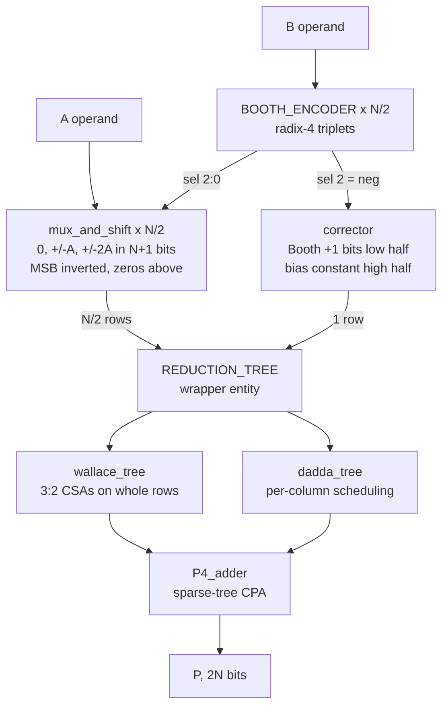

# Radix-4 Booth Multiplier — Sign-Extension Elimination and Dadda Reduction

A structural VHDL signed multiplier: radix-4 (modified) Booth encoding, a
selectable partial-product reduction tree, and a P4 sparse-tree carry-propagate
adder for the final sum. Targets Synopsys Design Compiler with the Nangate
45 nm open cell library; simulated in ModelSim / Questa.

Three variants share every source file and are selected by VHDL configuration:

| configuration | partial products | reduction | cells @ N=32 |
|---|---|---|---|
| `cfg_tb_base` | full sign extension | Wallace (uniform CSAs) | 776 |
| `cfg_tb_opt` | sign extension eliminated | Wallace (uniform CSAs) | 584 |
| `cfg_tb_opt_dadda` | sign extension eliminated | **Dadda (per-column)** | **480** |

All three are combinationally identical in function and pass the same exhaustive
testbench. The interesting parts are *how* the 776 becomes 480, and neither step
costs a single level of logic depth.

---

## Architecture



`REDUCTION_TREE` is a thin wrapper with two architectures — `wallace` and
`dadda` — each instantiating the corresponding tree entity. Swapping trees is
one line in `cfg/configurations.vhd`, and `BOOTHMUL` never changes.

| stage | block | what it does |
|---|---|---|
| encode | `booth_encoder` | one radix-4 encoder per bit pair of B → `sel = {neg, double, enable}` |
| generate | `mux_and_shift` | one partial-product row: `0`, `±A`, `±2A`, built in N+1 bits |
| correct | `corrector` | one extra row: Booth `+1`s in the low half, bias constant in the high half |
| reduce | `wallace_tree` / `dadda_tree` | N/2+1 rows down to carry + sum |
| add | `P4_adder` | sparse-tree carry-propagate adder → final 2N-bit product |

---

## Sign-extension elimination

Each Booth row holds an **(N+1)-bit two's complement** value — enough for ±2A.
Its MSB is a *sign* bit, so its weight is negative, but the reduction tree only
adds unsigned. The textbook fix is to replicate the sign bit up to bit 2N−1,
which at N=32 costs **256 of the 800 live bits in the array — 32%** — all of
them copies of one net.

### The identity

The sign needs weight `−s·2^P`. Since `s + ~s = 1`, we have `−s = ~s − 1`:

$$-s_i \cdot 2^{P} \;=\; \tilde{s_i}\cdot 2^{P} \;-\; 2^{P}$$

`~s` sits at position `P` — the slot the sign bit already occupied. No bit is
added; one bit is *inverted*, and everything above it is zero-filled.

### Why the leftover is a constant

| `s` | wanted | array holds `~s` | error |
|---|---|---|---|
| 0 | 0 | +2^P | **+2^P** |
| 1 | −2^P | 0 | **+2^P** |

The overshoot is identical either way, so it can be paid back once at design
time. Summed over all N/2 rows:

$$C \;=\; -\sum_{i=0}^{N/2-1} 2^{2i+N} \bmod 2^{2N}$$

which is the pattern `0xAAAA...AB` in bits `2N-1 downto N` (`0xB` at N=4,
`0xAB` at N=8, `0xAAAAAAAB` at N=32). See `common_pkg.sign_ext_const`.

### Why it costs no extra row

`C` occupies only bits `2N-1 downto N`; the Booth `+1` carries occupy only bits
`N-1 downto 0`. They never overlap, so **one row carries both** — the tree still
sees N/2+1 rows and needs no extra reduction layer. That is all `corrector` does.

---

## Dadda reduction

Wallace compresses maximally at every level: every group of three rows goes into
a CSA across the full width. Wherever fewer than three of those rows have a live
bit in a column, the CSA degenerates into a **half adder** — a cell that costs
area and reduces nothing, because it takes two bits in and puts two bits out.

Dadda instead computes a target height per level from the sequence
`2, 3, 4, 6, 9, 13, 19 …` and **touches only the columns that exceed it**.
A column already at or below target gets no cell at all.

The full adder count barely moves between the two (436 → 435 at N=32) — every
eliminated bit costs exactly one full adder, so that number is fixed by the
array, not by the schedule. What Dadda removes is the half adders: **148 → 45**.

### The rule

For column `k` at level `L` there are two distinct carry counts, and confusing
them is the trap:

| | meaning |
|---|---|
| `carries in` | adders in column `k-1` — these land in column `k` at level L+1 |
| `carries out` | adders in column `k` — these land in column `k+1` at level L+1 |

Only bits **present at level L** can be fed into an adder, but the target must be
checked against `present + carries in`:

```
excess = count + C_out_count - target
while excess > 0 :  FA if excess >= 2 (removes 2), else HA (removes 1)
                    require 3*nFA + 2*nHA <= count
```

Columns are visited LSB → MSB, because `carries in` for column `k` is not known
until column `k-1` has been decided.

### Implementation

`dadda_math_pkg.constructing_dadda` builds the whole schedule at elaboration and
returns one of three matrices selected by an opcode:

| opcode | returns | contents |
|---|---|---|
| 0 | `remaining_system` | bits no adder consumed — the pass-through sources |
| 1 | `HA_matrix` | the two source row positions of each half adder |
| 2 | `FA_matrix` | the three source row positions of each full adder |

The function walks levels top-down, and for each column marks the actual rows
feeding each adder and **clears those bits** from `system`. Whatever survives is
by definition the pass-through set — which is why one pass produces all three
matrices consistently. `fa_arg_func`, `ha_arg_func` and `remaining_bit_pos` then
recover the exact row indices for the port maps.

This matters because columns are *sparse*: live bits are not packed into rows
0,1,2… Tracking real positions rather than assuming a packed layout is what makes
the tree correct for a staggered Booth array.

### Slot convention

Within a column at level L+1, slots are allocated in a fixed order:

```
[ carries arriving from column k-1 ]  C_out_count
[ sums produced in column k        ]  nFA + nHA
[ bits passed through untouched    ]  count - 3*nFA - 2*nHA
```

Carries are written directly into column `k+1`, so — unlike the CSA tree, where
`Carry(i+1) <= Carry_temp(i)` does the ×2 — there is **no final shift**.

---

## Why any of this is exact

Every step is arithmetic in **Z / 2^(2N) Z**. The product output is 2N wires; a
value of weight 2^(2N) has nowhere to live. Three facts the design relies on are
really one fact — *multiples of 2^(2N) are zero*:

| statement | where it is used |
|---|---|
| `−x = ~x + 1` | Booth negation, with the `+1` deferred to `corrector` |
| ones from bit *p* upward `≡ −2^p` | the sign-extension identity |
| dropping a carry out of bit 2N−1 is free | CSA carry shift; Dadda's top-column carry |

And because a signed N×N product always fits in 2N bits, the residue the
hardware produces **is** the true answer. If the output were 2N+1 bits wide and
the top bit mattered, none of these tricks would be legal.

---

## Results

Adder cells in the reduction tree (from a bit-level model of the elaborated
netlist, not from synthesis):

| N | variant | full adders | half adders | cells | levels |
|---|---|---|---|---|---|
| 8 | BASE + wallace | 24 | 17 | 41 | 3 |
| 8 | OPT + wallace | 17 | 14 | 31 | 3 |
| 8 | **OPT + dadda** | **15** | **9** | **24** | 3 |
| 32 | BASE + wallace | 661 | 115 | 776 | 6 |
| 32 | OPT + wallace | 436 | 148 | 584 | 6 |
| 32 | **OPT + dadda** | **435** | **45** | **480** | 6 |

**−38% adder cells at N=32, at unchanged logic depth.** Neither optimization is
an area-for-timing trade: the removed adders sit on sign-extension columns and
on columns that never needed reducing, all off the critical path.

Baseline synthesis of the pre-optimization design, Nangate 45 nm,
`compile -map_effort high`: **8210 µm²**, 6903 combinational cells.

---

## Layout

```
rtl/
  common/                 constants, iv, nd2, mux21, mux21_generic, fa, ha
  adder/                  rca, carry_select_block, PG_block, PG_elem, G_block,
                          carry_generator, sum_generator, P4_adder
  multiplier/
    packages/
      common_pkg          NBIT, NROWS, pp_word, pp_array, sign_ext_const
      wallace_math_pkg    row counts and layer depth for the Wallace tree
      dadda_types_pkg     NUM_LAYERS_D (deferred constant), matrix types
      dadda_math_pkg      the Dadda schedule and the port-map position helpers
    booth_encoder, mux_and_shift, corrector, CSA
    reduction_tree        wrapper entity, architectures `wallace` and `dadda`
    wallace_tree          3:2 CSAs on whole rows
    dadda_tree            per-column scheduling
    boothmul              top level
tb/                       tb_multiplier
cfg/                      configurations  -- variant selection, analysed last
sim/                      compile.do, sim.do
docs/                     waveform printouts
```

`common_pkg` holds the partial-product port types. They have to live in a
package so both the entity and its instantiator can see them, and a VHDL-93
package cannot see a generic — so the width comes from the `NBIT` constant
rather than from a generic. `NBIT` is the single knob for the whole project,
testbench included.

`dadda_types_pkg` declares `NUM_LAYERS_D` as a **deferred constant** — declared
in the package header, given its value in the body — because it is computed by a
function that must be declared first.

---

## Running the simulation

```tcl
cd sim
do compile.do
do sim.do
```

The variant is one line at the top of `sim.do`:

```tcl
set CFG work.cfg_tb_opt_dadda
# set CFG work.cfg_tb_opt
# set CFG work.cfg_tb_base
```

`NBIT` in `rtl/multiplier/packages/common_pkg.vhd` sets the width; the testbench
follows it automatically.

| `NBIT` | testbench mode |
|---|---|
| ≤ 8 | exhaustive — every operand pair, 65536 at 8 bits |
| > 8 | corner cases (0, ±1, max, min) + 20000 random pairs |

Current status at `NBIT = 8`, all three configurations:

```
# ** Note: PASS - 65561 vectors, 0 mismatches
```

---

## Running synthesis

Not yet committed. When adding it, one thing matters more than usual:

```tcl
elaborate boothmul
ungroup -all -flatten      # <-- do not skip this
compile -map_effort high
```

With plain `compile` and no boundary optimization, DC optimizes each subdesign
in isolation with unknown input ports. Every constant these optimizations create
sits on a design boundary — `corrector`'s high half is entirely constant, and the
zero-filled upper halves of every row cross into the tree's ports. Without
ungrouping, none of it propagates and the measured improvement is **zero**.

---

## Notes and limitations

- **The Dadda schedule is specific to the sign-extension-eliminated layout.**
  `making_inital_layer` hard-codes those column heights, so `dadda` is only valid
  against `mux_and_shift(no_sign_extend)` + `corrector(no_sign_extend)`. That is
  why there is no `BASE + dadda` configuration. Nothing in the code currently
  prevents writing one.
- **The mux/corrector architectures must stay paired.** `no_sign_extend` biases
  each row by `+2^(2i+N)` and relies on the corrector's constant to cancel it;
  mixing them is wrong on 100% of inputs.
- `pp_layout_t` in `common_pkg` is currently unused — a leftover from an earlier
  attempt at a layout-generic tree.

---

## Roadmap

- [x] Sign-extension elimination — 776 → 584 adder cells
- [x] Dadda reduction — 584 → 480 adder cells, same depth
- [ ] **Measured synthesis numbers** for all three variants under one flow
- [ ] **4:2 compressors** if depth rather than area becomes the target
- [ ] **Baugh-Wooley comparison.** It produces N rows of N bits, so it reuses the
      tree and the P4 adder unchanged. Analysis puts radix-4 Booth ~33% ahead at
      N=32 and roughly level at N=8 — worth confirming under a real flow, and
      Baugh-Wooley may well win on power.

Per-row-width CSAs were considered and dropped. Constant propagation already
removes the dead adders in a uniform-width tree, so hard-coding the widths
produces *identical* logic — 584 cells either way. It only shrinks the netlist
you write (960 → 728 instances), which matters solely if you synthesise without
`ungroup`. The real waste was the scheduling, which is what Dadda fixes.
