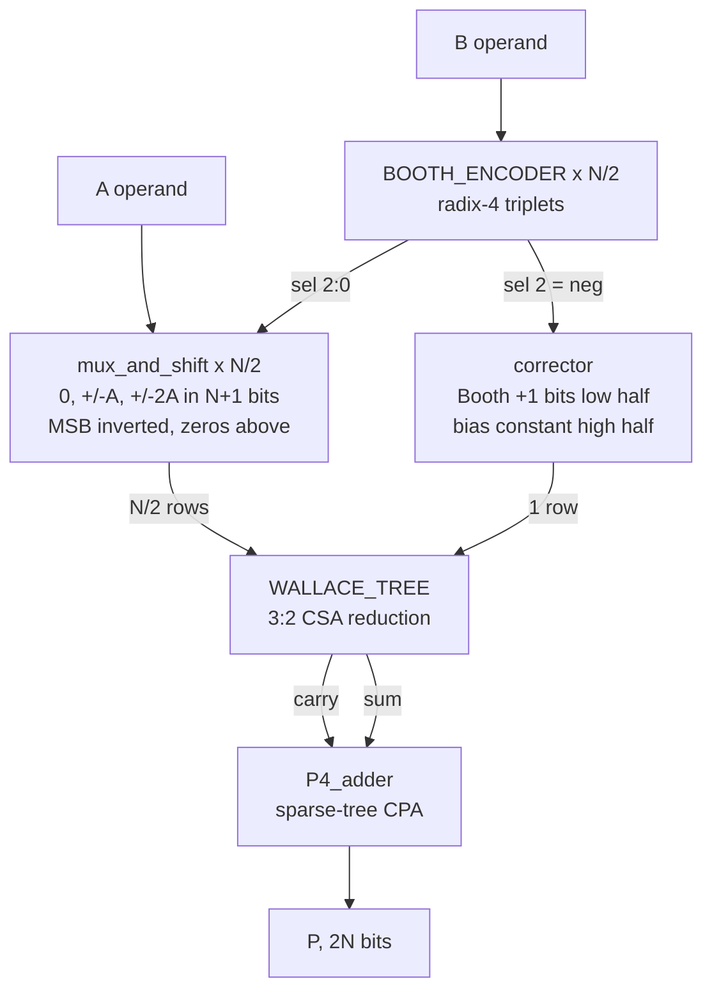

# Radix-4 Booth Multiplier with Sign-Extension Elimination

A structural VHDL signed multiplier: radix-4 (modified) Booth encoding, a Wallace
tree of 3:2 carry-save adders, and a P4 sparse-tree carry-propagate adder for the
final sum. Targets Synopsys Design Compiler with the Nangate 45 nm open cell
library; simulated in ModelSim / Questa.

The interesting part is the partial-product array: sign extension is eliminated
algebraically, which removes about a third of the bits entering the reduction
tree at no cost in logic depth.

---

## Architecture



| stage | block | what it does |
|---|---|---|
| encode | `booth_encoder` | one radix-4 encoder per bit pair of B → `sel = {neg, double, enable}` |
| generate | `mux_and_shift` | one partial-product row: `0`, `±A`, `±2A`, built in N+1 bits |
| correct | `corrector` | one extra row holding the Booth `+1`s and the bias constant |
| reduce | `wallace_tree` | 3:2 CSA layers, N/2+1 rows down to carry + sum |
| add | `P4_adder` | sparse-tree carry-propagate adder → final 2N-bit product |

---

## Sign-extension elimination

Each Booth row holds an **(N+1)-bit two's complement** value — enough for ±2A.
Its MSB is a *sign* bit, so its weight is negative, but the reduction tree only
adds unsigned. The textbook fix is to replicate the sign bit up to bit 2N−1:

```
row 0:   s0 s0 s0 s0 s0 ... s0  q0[N-1..0]      <- up to N-1 replica bits
```

Those replicas are all copies of one net. At N=32 they account for **256 of the
800 live bits in the array — 32%.**

### The identity

The sign needs weight `−s·2^P`. Since `s + ~s = 1`, we have `−s = ~s − 1`, so:

$$-s_i \cdot 2^{P} \;=\; \tilde{s_i}\cdot 2^{P} \;-\; 2^{P}$$

`~s` sits at position `P` — the slot the sign bit already occupied. No bit is
added; one bit is *inverted*, and everything above it is zero-filled.

### Why the leftover is a constant

| `s` | wanted | array holds `~s` | error |
|---|---|---|---|
| 0 | 0 | +2^P | **+2^P** |
| 1 | −2^P | 0 | **+2^P** |

The overshoot is the same either way, so it can be paid back once, at design
time. Summed over all N/2 rows:

$$C \;=\; -\sum_{i=0}^{N/2-1} 2^{2i+N} \bmod 2^{2N}$$

which is the pattern `0xAAAA...AB` in bits `2N-1 downto N` (`0xB` at N=4,
`0xAB` at N=8, `0xAAAAAAAB` at N=32). See `pp_pkg.sign_ext_const`.

### Why it costs no extra row

`C` occupies only bits `2N-1 downto N`. The Booth `+1` carries occupy only bits
`N-1 downto 0`. They never overlap, so **one row carries both** — the tree still
sees N/2+1 rows and needs no extra reduction layer. That is all `corrector` does.

### Why it is exact rather than approximate

Every step is arithmetic in **Z / 2^(2N) Z**. The product output is 2N wires; a
value of weight 2^(2N) has nowhere to live. Three facts the design relies on are
really one fact — *multiples of 2^(2N) are zero*:

| statement | where it is used |
|---|---|
| `−x = ~x + 1` | Booth negation, with the `+1` deferred to `corrector` |
| ones from bit *p* upward `≡ −2^p` | the sign-extension identity above |
| dropping a CSA carry-out of bit 2N−1 is free | `CSA` shifts carry left and truncates |

And because a signed N×N product always fits in 2N bits, the residue the
hardware produces **is** the true answer. If the output were 2N+1 bits wide and
the top bit mattered, none of this would be legal.

---

## Results

Bit-level analysis at N=32 (counts from a model of the elaborated netlist, not
from synthesis):

| | before | after |
|---|---|---|
| live PP bits | 800 | **544** |
| real full adders | 661 | **436** |
| half adders / constant-merged cells | 115 | 148 |
| total adder cells | 776 | **584 (−25%)** |
| CSA reduction layers | 6 | **6 (unchanged)** |

This is not an area-for-timing trade — the removed adders sit on sign-extension
and near-zero columns, off the critical path.

Adding Dadda reduction on top, all four variants at N=32:

| variant | full adders | half adders | cells | levels |
|---|---|---|---|---|
| BASE + uniform | 661 | 115 | 776 | 6 |
| BASE + dadda | 658 | 62 | 720 | 6 |
| OPT + uniform | 436 | 148 | 584 | 6 |
| **OPT + dadda** | **435** | **45** | **480** | **6** |

Depth is identical across all four. Note how little the full adder count moves
between uniform and dadda — eliminating a bit always costs one full adder, so
that number is fixed by the array, not the schedule. What Dadda removes is the
half adders, which shift a bit sideways without eliminating anything.

Baseline synthesis of the pre-optimization design, Nangate 45 nm,
`compile -map_effort high`: **8210 µm²**, 6903 combinational cells.

---

## Layout

```
rtl/
  common/       constants, iv, nd2, mux21, mux21_generic, fa, ha
  adder/        rca, carry_select_block, PG_block, PG_elem, G_block,
                carry_generator, sum_generator, P4_adder
  multiplier/   pp_pkg, const_math_pkg, dadda_pkg, booth_encoder,
                mux_and_shift, corrector, CSA,
                reduction_tree (uniform), dadda_tree (dadda), boothmul
tb/             tb_multiplier
cfg/            configurations  -- variant selection, analysed last
sim/            compile.do, sim.do
docs/           waveform printouts
```

`pp_pkg.vhd` holds the partial-product port types. They have to live in a
package so both the entity and its instantiator can see them, and a VHDL-93
package cannot see a generic — so the **width** comes from the `NBIT` constant
while the **number of rows** stays generic (`pp_array` is unconstrained in its
outer dimension).

---

## Running the simulation

```tcl
cd sim
do compile.do
do sim.do
```

Which variant runs is one line at the top of `sim.do`:

| configuration | PP generation | reduction |
|---|---|---|
| `cfg_tb_opt_dadda` | sign extension eliminated | Dadda |
| `cfg_tb_opt` | sign extension eliminated | uniform CSA |
| `cfg_tb_base` | full sign extension | uniform CSA |
| `cfg_tb_base_dadda` | full sign extension | Dadda |

All four must pass the same exhaustive testbench — they are different circuits
computing the same function.

`NBIT` in `rtl/multiplier/pp_pkg.vhd` is the only width knob; the testbench
follows it automatically.

| `NBIT` | testbench mode |
|---|---|
| ≤ 8 | exhaustive — every operand pair, 65536 at 8 bits |
| > 8 | corner cases (0, ±1, max, min) + 20000 random pairs |

The testbench is self-checking against `signed * signed` and prints a
`PASS - <n> vectors, 0 mismatches` summary. Mismatches are reported at severity
ERROR so the run completes and reports the full count.

---

## Running synthesis

Not yet committed — the flow lives outside this repo for now. When adding it,
one thing matters more than usual:

```tcl
elaborate boothmul
ungroup -all -flatten      # <-- do not skip this
compile -map_effort high
```

With plain `compile` and no boundary optimization, DC optimizes each subdesign
in isolation with unknown input ports. Every constant this optimization creates
sits on a design boundary — `corrector`'s high half is entirely constant, and
the zero-filled upper halves of every row cross into `WALLACE_TREE`'s ports.
Without ungrouping, none of it propagates and the measured area improvement is
**zero**.

---

## Roadmap

- [x] Sign-extension elimination (−25% adder cells)
- [x] **Dadda reduction.** 584 → 480 adder cells at the same depth. Almost the
      entire saving is half adders (148 → 45); the full adder count barely
      moves, because the number of bits that must be eliminated is fixed.
- [ ] **4:2 compressors** if depth rather than area becomes the target.
- [ ] **Measured synthesis numbers** for all four variants under one flow.

Per-row-width CSAs were considered and dropped. Constant propagation already
removes the dead adders in a uniform-width tree, so hard-coding the widths
produces *identical* logic — 584 cells either way. It only shrinks the netlist
you write (960 → 728 instances), which matters solely if you synthesise without
`ungroup`. The real waste was the scheduling, which is what Dadda fixes.
- [ ] **Baugh-Wooley comparison.** It produces N rows of 2N bits, which is
      exactly what `WALLACE_TREE` already accepts, so it reuses the tree and the
      P4 adder unchanged. Analysis puts radix-4 Booth ~33% ahead at N=32 and
      roughly level at N=8 — worth confirming under a real synthesis flow, and
      Baugh-Wooley may well win on power.
