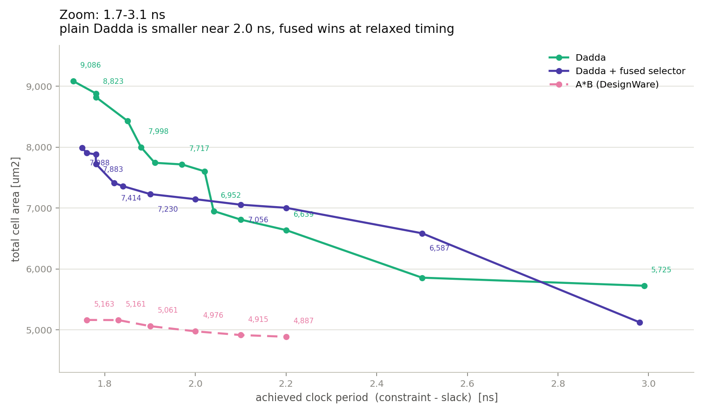

# Radix-4 Booth Multiplier - 32-bit Nangate45 implementation

This repository develops and evaluates a signed 32 x 32 radix-4 Booth
multiplier in structural VHDL. The main goal is to show how three RTL
transformations affect the area-delay trade-off while preserving the same
arithmetic function:

1. eliminate explicit sign-extension bits from the partial-product array;
2. replace a uniform row-wise Wallace reduction with a generated Dadda
   schedule; and
3. fuse Booth magnitude selection and conditional negation into one Boolean
   cone.

All structural variants use the same entities and are selected through VHDL
configurations. A registered multiplier inferred from `P <= A * B` is
synthesized under the same constraints as a controlled reference.

[Technical report](docs/report.pdf) | [Presentation](docs/presentation.pdf) |
[Editable schematic](docs/schematic.drawio)

## Headline result

The final structural variant, Dadda reduction with the fused selector, reaches:

- fastest derived zero-slack period: **1.76 ns**;
- minimum observed area: **5029 um^2**; and
- **69.1%** of the minimum-area gap closed between the structural baseline and
  the inferred `A * B` reference.

The timing and minimum-area values above come from different synthesized
netlists. They are the two ends of the variant's measured trade-off, not one
simultaneous operating point.

## Datapath and variants


The radix-4 encoder maps each overlapping multiplier triplet to
`0`, `+A`, `-A`, `+2A`, or `-2A`. Partial products are shifted by two
bits per Booth digit, compressed to two rows, and added by a P4 carry-propagate
adder.

| Variant | `mux_and_shift` | `corrector` | `reduction_tree` |
| :-- | :-- | :-- | :-- |
| Wallace baseline | `sign_extend` | `sign_extend` | `wallace` |
| Sign-extension eliminated | `no_sign_extend` | `no_sign_extend` | `wallace` |
| Dadda | `no_sign_extend` | `no_sign_extend` | `dadda` |
| Dadda + fused selector | `fused_selector` | `no_sign_extend` | `dadda` |
| Behavioural Booth | `behavioural` | not used | adder chain |
| Inferred reference | `P <= A * B` | not used | inferred by Design Compiler |

The optimized partial-product format and its corrector must be used together.
Each stored row is biased by `+2^(N+2i)`; the
`corrector(no_sign_extend)` architecture cancels the sum of those
data-independent biases while also supplying the usual Booth `+1` terms for
negative digits.

## What each optimization changes

### 1. Sign-extension elimination

A two's-complement partial product normally repeats its sign through the upper
columns. The optimized representation keeps the `N` low bits, stores the
inverted sign bit once, and fills the remaining upper bits with zero. This adds
the same constant bias to every row, so a fixed correction constant restores
the exact product modulo `2^(2N)`.

For `N = 32`:

- partial-product array size falls from **800 to 561 bits**;
- minimum area falls from **6346 to 5975 um^2**; and
- cell count at a 3.0 ns constraint falls from **4639 to 4455**.

### 2. Generated Dadda reduction

The Dadda package computes column heights and compressor placement at
elaboration time. At `N = 32`, the uniform row-wise tree instantiates 960
full adders in RTL, whereas the generated Dadda schedule uses 435 full adders
and 45 half adders.

Measured against the sign-extension-eliminated Wallace design:

- minimum area falls from **5975 to 5620 um^2**; and
- fastest derived zero-slack period improves from **1.87 to 1.78 ns**.

The mapped full-adder cell count is not expected to equal the RTL instance
count because synthesis can decompose or restructure compressors.

### 3. Fused Booth selector

The original selector first chooses `A` or `2A` and then applies a separate
XOR-based conditional inversion. The fused architecture decodes the four
non-zero Booth cases directly and expresses each result bit as one sum-of-
products function. The zero case is implicit when none of the four terms is
active.

This removes the explicit XOR boundary and gives the technology mapper more
freedom to use compound cells. At a common 3.0 ns constraint, the mapped cell
mix changes as follows:

| Design | XOR + XNOR | FA cells | AOI/OAI | Total cells | Area |
| :-- | --: | --: | --: | --: | --: |
| Dadda, separate negation | 1230 | 117 | 1405 | 3936 | 5725 um^2 |
| Dadda, fused selector | 85 | 448 | 1311 | 2819 | 5125 um^2 |
| Inferred `A * B` | 559 | 268 | 950 | 3035 | 4910 um^2 |

These counts cover the complete mapped design, including the final adder. They
show that mapping changed substantially, but they do not provide a one-to-one
correspondence between RTL operators and library cells.

Relative to the separate-negation Dadda design, the fused version reduces the
minimum observed area from **5620 to 5029 um^2** and improves the fastest
derived period from **1.78 to 1.76 ns**. It is not smaller at every timing
target; the two Dadda Pareto curves cross, so the preferred implementation
depends on the required period.

## Synthesis results

The archived sweep contains 21 timing targets for each of six configurations.
For every fixed netlist, the reported setup equation is converted to a derived
zero-slack period:

`T0 = requested clock period - reported slack`

A negative slack therefore produces a `T0` larger than the requested period.
This metric compares the netlists generated across the sweep; it does not claim
that resynthesizing at `T0` would reproduce the same netlist.

| Variant | Fastest `T0` | Area of fastest netlist | Minimum area | Area gap closed |
| :-- | --: | --: | --: | --: |
| Wallace baseline | 1.86 ns | 10022 um^2 | 6346 um^2 | - |
| + sign-extension elimination | 1.87 ns | 9234 um^2 | 5975 um^2 | 19.5% |
| + Dadda reduction | 1.78 ns | 8823 um^2 | 5620 um^2 | 38.1% |
| **+ fused selector** | **1.76 ns** | **8008 um^2** | **5029 um^2** | **69.1%** |
| Behavioural Booth | 2.01 ns | 7991 um^2 | 6210 um^2 | 7.1% |
| Inferred `A * B` | 1.63 ns | 5337 um^2 | 4441 um^2 | reference |

"Area of fastest netlist" and "minimum area" generally refer to different
runs. The area-gap percentage uses the minimum-area column:

`gap closed = (baseline area - variant area) / (baseline area - reference area)`

Because Design Compiler optimization is target-dependent and non-monotonic,
the plotted curves are Pareto fronts over all runs rather than raw
per-constraint traces.


The zoomed view makes the crossover between the two Dadda implementations
visible:



## Verification

All configurations use the same self-checking testbench and are compared
against signed multiplication:

- for `NBIT <= 8`: exhaustive testing of every input pair;
- for `NBIT > 8`: directed corner cases followed by 20,000 random pairs.

The reported 32-bit runs passed this simulation campaign. This is strong
functional evidence, but it is not a formal equivalence proof and does not
exhaust the full 32-bit input space.

## Scope and limitations

The results are pre-layout synthesis results for the Nangate 45 nm library.
They include a wire-load model, but not placement, routing, extracted
parasitics, clock-tree synthesis, or post-layout timing. The project also does
not currently include:

- formal equivalence checking between configurations;
- gate-level simulation with SDF back-annotation; or
- activity-driven power comparison.

The numerical conclusions should therefore be read as controlled synthesis
comparisons, not sign-off silicon results.

## Repository layout

```text
rtl/
  common/                 primitive gates, full adder, and half adder
  adder/                  P4 carry-propagate adder
  multiplier/
    packages/             dimensions and generated reduction schedule
    booth_encoder.vhd     radix-4 recoding
    mux_and_shift.vhd     baseline, optimized, and fused row generation
    corrector.vhd         Booth increments and sign-extension correction
    wallace_tree.vhd      uniform row-wise compression
    dadda_tree.vhd        generated column-aware compression
    reduction_tree.vhd    tree-selection wrapper
    boothmul*.vhd         combinational and registered top levels
  super_beh_multiplier_registered.vhd
cfg/                      design, testbench, and synthesis configurations
tb/                       shared self-checking testbench
sim/                      ModelSim/Questa scripts
synthesis/
  syn/synthesis.tcl       Design Compiler sweep
  syn/reports/            archived reports used by the plots and documents
  plot_pareto.py          report parser and Pareto plotting
docs/
  report.tex/.pdf         detailed design report
  presentation.tex/.pdf   recruiter-facing presentation
  schematic.drawio        editable block diagram
```

`NBIT` in `rtl/multiplier/packages/common_pkg.vhd` controls the operand
width used by the RTL, generated reduction schedule, and testbench.

## Running the project

### Simulation

Select a testbench configuration near the top of `sim/sim.do`, then run:

```tcl
cd sim
do compile.do
do sim.do
```

Available testbench configurations include `cfg_tb_dadda_fused_sel`,
`cfg_tb_dadda`, `cfg_tb_wal_opt`, `cfg_tb_wal_base`, `cfg_tb_beh`, and
`cfg_tb_super_beh`.

### Synthesis

Choose the configurations and period list near the top of
`synthesis/syn/synthesis.tcl`, then run:

```tcl
cd synthesis/syn
dc_shell -f synthesis.tcl
```

Each run writes a Verilog netlist, SDC, SDF, and five reports: timing, area,
quality of results, reference-cell usage, and clock-gating information.

### Regenerate plots

```bash
cd synthesis
python3 plot_pareto.py syn/reports -o ../docs/figures --zoom 1.7 3.1
```

### Build the documentation

```bash
cd docs
pdflatex schematic.tex
pdflatex report.tex
pdflatex report.tex
pdflatex presentation.tex
pdflatex presentation.tex
```

The report contains the derivations, implementation details, result
provenance, and limitations. The presentation intentionally keeps only the
main design decisions and evidence needed for a technical interview.
