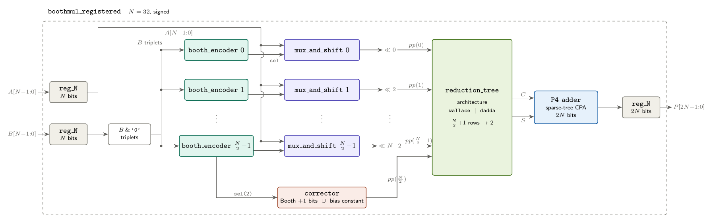
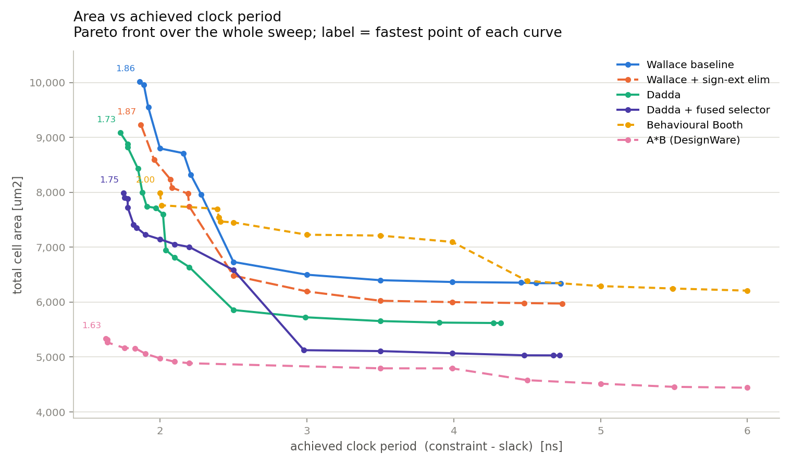
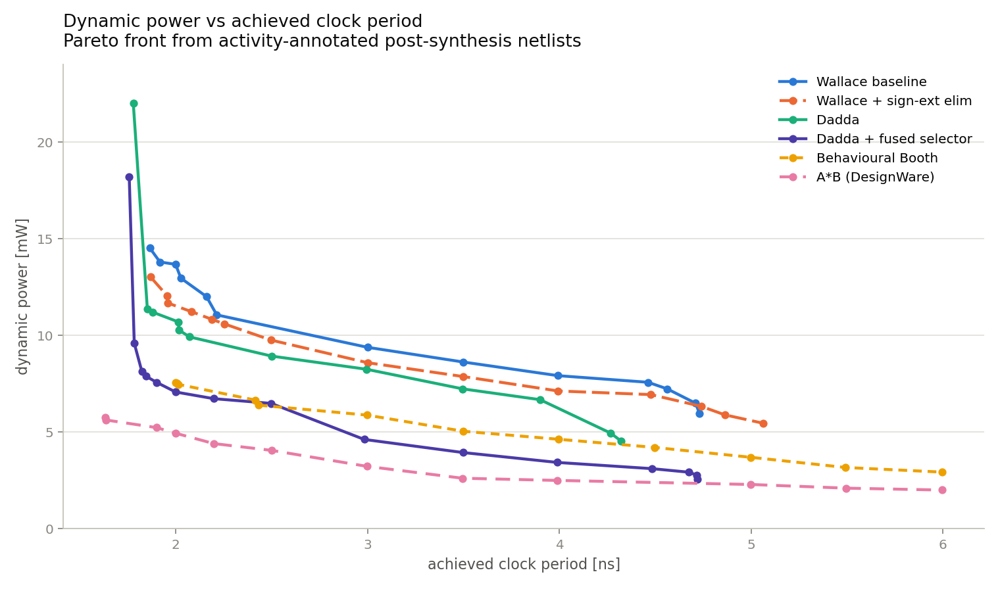
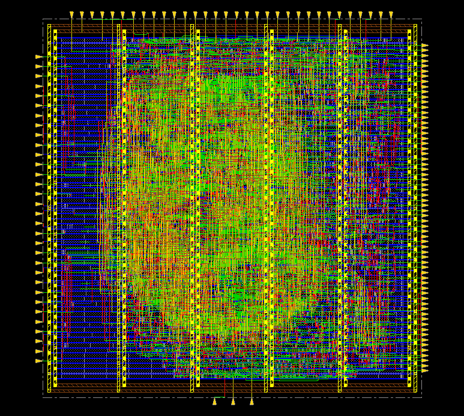

# Radix-4 Booth Multiplier - 32-bit Nangate45 implementation

This repository develops and evaluates a signed 32 x 32 radix-4 Booth
multiplier in structural VHDL. The main goal is to show how three RTL
transformations affect the area-delay trade-off while preserving the same
arithmetic function:

1. eliminate explicit sign-extension bits from the partial-product array;
2. replace a uniform row-wise Wallace reduction with a generated Dadda
   schedule; and
3. fuse Booth magnitude selection and conditional negation into one Boolean
   cone.

All structural variants use the same entities and are selected through VHDL
configurations. A registered multiplier inferred from `P <= A * B` is
synthesized under the same constraints as a controlled reference.

[Technical report](docs/report.pdf) | [Presentation](docs/presentation.pdf) |
[Editable schematic](docs/schematic.drawio)

## Headline result

The final structural variant, Dadda reduction with the fused selector, reaches:

- fastest derived zero-slack period: **1.75 ns**;
- minimum observed area: **5029 um^2**; and
- **69.1%** of the minimum-area gap closed between the structural baseline and
  the inferred `A * B` reference.

Plain Dadda reaches the fastest structural point at **1.73 ns**. The fused
selector instead gives the strongest area and dynamic-power results. At the
common 3.0 ns synthesis target it measures **4.61 mW** of dynamic power, 44.1%
below plain Dadda under the same post-synthesis activity workload.

## Datapath and variants

<p align="center">
  
</p>

The radix-4 encoder maps each overlapping multiplier triplet to
`0`, `+A`, `-A`, `+2A`, or `-2A`. Partial products are shifted by two
bits per Booth digit, compressed to two rows, and added by a P4 carry-propagate
adder.

| Variant | `mux_and_shift` | `corrector` | `reduction_tree` |
| :-- | :-- | :-- | :-- |
| Wallace baseline | `sign_extend` | `sign_extend` | `wallace` |
| Sign-extension eliminated | `no_sign_extend` | `no_sign_extend` | `wallace` |
| Dadda | `no_sign_extend` | `no_sign_extend` | `dadda` |
| Dadda + fused selector | `fused_selector` | `no_sign_extend` | `dadda` |
| Behavioural Booth | `behavioural` | not used | adder chain |
| Inferred reference | `P <= A * B` | not used | inferred by Design Compiler |

The optimized partial-product format and its corrector must be used together.
Each stored row is biased by `+2^(N+2i)`; the
`corrector(no_sign_extend)` architecture cancels the sum of those
data-independent biases while also supplying the usual Booth `+1` terms for
negative digits.

## What each optimization changes

### 1. Sign-extension elimination

A two's-complement partial product normally repeats its sign through the upper
columns. The optimized representation keeps the `N` low bits, stores the
inverted sign bit once, and fills the remaining upper bits with zero. This adds
the same constant bias to every row, so a fixed correction constant restores
the exact product modulo `2^(2N)`.

For `N = 32`:

- partial-product array size falls from **800 to 561 bits**;
- minimum area falls from **6346 to 5975 um^2**; and
- cell count at a 3.0 ns constraint falls from **4639 to 4455**.

### 2. Generated Dadda reduction

The Dadda package computes column heights and compressor placement at
elaboration time. At `N = 32`, the uniform row-wise tree instantiates 960
full adders in RTL, whereas the generated Dadda schedule uses 435 full adders
and 45 half adders.

Measured against the sign-extension-eliminated Wallace design:

- minimum area falls from **5975 to 5620 um^2**; and
- fastest derived zero-slack period improves from **1.87 to 1.73 ns**.

### 3. Fused Booth selector

The original selector first chooses `A` or `2A` and then applies a separate
XOR-based conditional inversion. The fused architecture decodes the four
non-zero Booth cases directly and expresses each result bit as one sum-of-
products function. The zero case is implicit when none of the four terms is
active.

This removes the explicit XOR boundary and gives the technology mapper more
freedom to use compound cells. At a common 3.0 ns constraint, the mapped cell
mix changes as follows:

| Design | XOR + XNOR | FA cells | AOI/OAI | Total cells | Area |
| :-- | --: | --: | --: | --: | --: |
| Dadda, separate negation | 1230 | 117 | 1405 | 3936 | 5725 um^2 |
| Dadda, fused selector | 85 | 448 | 1311 | 2819 | 5125 um^2 |
| Inferred `A * B` | 559 | 268 | 950 | 3035 | 4910 um^2 |

These counts cover the complete mapped design, including the final adder, and
show how strongly the fused selector changes the mapped cell mix.

Relative to the separate-negation Dadda design, the fused version reduces the
minimum observed area from **5620 to 5029 um^2**. Its fastest point is
**1.75 ns**, compared with **1.73 ns** for plain Dadda. The fused selector has
the lower dynamic-power curve throughout the measured power sweep.

## Synthesis results

The synthesis data contains 21 common timing targets for all six
configurations. The two Dadda variants also include six tighter targets from
0.4 to 0.9 ns. For every fixed netlist, the reported setup equation is
converted to a derived zero-slack period:

`T0 = requested clock period - reported slack`

A negative slack therefore produces a `T0` larger than the requested period.

| Variant | Fastest `T0` | Area of fastest netlist | Minimum area | Area gap closed |
| :-- | --: | --: | --: | --: |
| Wallace baseline | 1.86 ns | 10022 um^2 | 6346 um^2 | - |
| + sign-extension elimination | 1.87 ns | 9234 um^2 | 5975 um^2 | 19.5% |
| + Dadda reduction | **1.73 ns** | 9086 um^2 | 5620 um^2 | 38.1% |
| **+ fused selector** | 1.75 ns | **7988 um^2** | **5029 um^2** | **69.1%** |
| Behavioural Booth | 2.00 ns | 7986 um^2 | 6210 um^2 | 7.1% |
| Inferred `A * B` | 1.63 ns | 5337 um^2 | 4441 um^2 | reference |

The area-gap percentage uses the minimum-area column:

`gap closed = (baseline area - variant area) / (baseline area - reference area)`

The plotted curves are Pareto fronts over all synthesis runs.



## Area and post-synthesis power at 3.0 ns

Each mapped netlist was simulated with maximum-delay SDF at its own achieved
period. A 500-vector deterministic operand sequence produced the VCD activity,
which was converted to SAIF and annotated in Power Compiler. All 120 committed
activity reports show 100% annotation of nets, ports, and pins.

At the common 3.0 ns synthesis target, area and power compare as follows:

| Variant | Achieved period | Area | Dynamic | Leakage | Total power |
| :-- | --: | --: | --: | --: | --: |
| Wallace baseline | 3.000 ns | 6501 um^2 | 9.38 mW | 0.148 mW | 9.53 mW |
| + sign-extension elimination | 3.000 ns | 6196 um^2 | 8.58 mW | 0.138 mW | 8.72 mW |
| + Dadda reduction | 2.993 ns | 5725 um^2 | 8.25 mW | 0.129 mW | 8.38 mW |
| **+ fused selector** | **2.983 ns** | **5125 um^2** | **4.61 mW** | **0.119 mW** | **4.73 mW** |
| Behavioural Booth | 2.998 ns | 7229 um^2 | 5.87 mW | 0.158 mW | 6.03 mW |
| Inferred `A * B` | 2.998 ns | 4910 um^2 | 3.22 mW | 0.103 mW | 3.32 mW |

Dynamic power is the sum of internal and switching power reported by Power
Compiler. Total power adds leakage to that dynamic value. The fused selector
reduces both area and total power by about **21%** and **50%**, respectively,
relative to the Wallace baseline at this target.

The fused selector reduces dynamic power by **44.1%** relative to plain Dadda
and by **50.8%** relative to the Wallace baseline at this point. It remains
43.3% above the inferred reference. The full power-latency comparison uses a
separate Pareto calculation over the activity-annotated power points:



## Verification

All configurations use the same self-checking testbench and are compared
against signed multiplication:

- for `NBIT <= 8`: exhaustive testing of every input pair;
- for `NBIT > 8`: directed corner cases followed by 20,000 random pairs.

The reported 32-bit runs passed this simulation campaign.

## Physical design

The fused-selector netlist synthesized at 3.0 ns was placed and routed in
Cadence Innovus 23.35. The scripted flow covers floorplan, power grid,
placement, clock-tree synthesis, routing, optimization, fillers and sign-off
checks. The method and commands are described in
[physical_design/README.md](physical_design/README.md).

<p align="center">
  
</p>

| Quantity | Synthesis | Post-route |
| :-- | --: | --: |
| Setup slack at 3.0 ns | 0.017 ns | 0.782 ns |
| Derived period `T0` | 2.983 ns | **2.218 ns** |
| Hold slack | - | 0.050 ns |
| Standard-cell area | 5125 um^2 | 5130 um^2 |
| Die (60% utilization) | - | 102.6 x 102.6 um |
| Clock tree | ideal | 3 buffers, 7 ps skew |
| DRC / opens / antenna | - | 0 / 0 / 0 |

The layout closes cleanly. Optimization adds only 0.09% cell area.

The critical path is the same in both tools, from bit 1 of `B` to bit 59 of
`P`. It arrives at 2.95 ns in synthesis but at 2.21 ns after routing. The
`5K_hvratio_1_4` wire-load model charged about 1.0 ns for interconnect that
really costs about 0.24 ns. The synthesis periods above are therefore
pessimistic in absolute terms. The physical-design sweep checks whether the
ranking of the variants holds.

At the corners, setup at the slow corner (125 C) fails by 4.56 ns. Hold at
the fast corner (0 C) misses by at most 3 ps on 32 paths. The flow optimizes
the typical corner only, as the synthesis does.

The 4.18 mW that Innovus reports uses a default activity of 0.2. It is not
comparable with the SAIF-based synthesis power until the post-layout
simulation provides real activity.

### Next step: post-layout Pareto curves

Every synthesized netlist is placed and routed at the period it achieved in
synthesis. It is then simulated with its routed SDF at its post-route
achieved period, and its power is computed from that activity. This gives the
same area-latency and power-latency fronts as above, measured after layout.

## Repository layout

```text
rtl/
  common/                 primitive gates, full adder, and half adder
  adder/                  P4 carry-propagate adder
  multiplier/
    packages/             dimensions and generated reduction schedule
    booth_encoder.vhd     radix-4 recoding
    mux_and_shift.vhd     baseline, optimized, and fused row generation
    corrector.vhd         Booth increments and sign-extension correction
    wallace_tree.vhd      uniform row-wise compression
    dadda_tree.vhd        generated column-aware compression
    reduction_tree.vhd    tree-selection wrapper
    boothmul*.vhd         combinational and registered top levels
  super_beh_multiplier_registered.vhd
cfg/                      design, testbench, and synthesis configurations
tb/                       shared self-checking testbench
sim/                      ModelSim/Questa scripts
synthesis/
  README.md               complete synthesis and power workflow
  sweep_config.tcl        shared configurations and periods
  syn/synthesis.tcl       Design Compiler sweep
  syn/power_analysis.tcl  activity-annotated power analysis
  syn/reports/            canonical area and timing reports
  syn/reports_power/      canonical power reports and CSVs
  plot_pareto.py          area and dynamic-power Pareto plotting
physical_design/
  run_pd.sh               place and route of every netlist (Innovus)
  sim/sim_postlayout.do   post-layout simulation with the routed SDF
  run_power.sh            power from the simulation activity
  collect_pd_results.py   post-layout CSVs for plot_pareto.py
  scripts/                Innovus flow, import settings, MMMC, power
  runs/<cfg>_<period>/    one directory per routed netlist
docs/
  report.tex/.pdf         detailed design report
  presentation.tex/.pdf   recruiter-facing presentation
  schematic.drawio        editable block diagram
```

`NBIT` in `rtl/multiplier/packages/common_pkg.vhd` controls the operand
width used by the RTL, generated reduction schedule, and testbench.

## Running the project

### Simulation

Select a testbench configuration near the top of `sim/sim.do`, then run:

```tcl
cd sim
do compile.do
do sim.do
```

Available testbench configurations include `cfg_tb_dadda_fused_sel`,
`cfg_tb_dadda`, `cfg_tb_wal_opt`, `cfg_tb_wal_base`, `cfg_tb_beh`, and
`cfg_tb_super_beh`.

### Synthesis

Edit `synthesis/sweep_config.tcl` if the sweep needs to change, then run:

```tcl
cd synthesis/syn
dc_shell -f synthesis.tcl
```

Each run writes a Verilog netlist, SDC, SDF, and five reports: timing, area,
quality of results, reference-cell usage, and clock-gating information.

The achieved-period extraction, gate-level SDF activity simulation, and power
analysis are documented in [synthesis/README.md](synthesis/README.md).

### Physical design

```bash
cd physical_design
./run_pd.sh
cd sim && vsim -c -do sim_postlayout.do && cd ..
./run_power.sh
python3 collect_pd_results.py
```

See [physical_design/README.md](physical_design/README.md).

### Regenerate plots

```bash
cd synthesis
python3 plot_pareto.py syn/reports --power-reports syn/reports_power \
  -o ../docs/figures --zoom 1.7 3.1
python3 plot_pareto.py --pd-results ../physical_design/results -o ../docs/figures
```

The second command draws the same fronts from the post-layout results
(`*_postlayout.png`).
